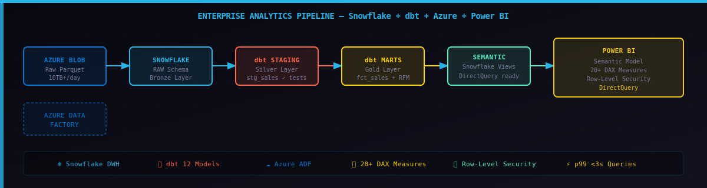

# Enterprise Analytics Pipeline — Snowflake + dbt + Azure + Power BI


> End-to-end enterprise analytics pipeline: Azure Blob → Snowflake → dbt (Bronze/Silver/Gold) → Power BI Semantic Models with live DAX measures, RFM segmentation, and row-level security.

## Architecture



## Stack

| Layer | Technology | Purpose |
|-------|-----------|---------|
| **Ingestion** | Azure Blob Storage + ADF | Raw data landing + orchestration |
| **Storage** | Snowflake | Cloud data warehouse |
| **Transformation** | dbt Core | Bronze → Silver → Gold layers |
| **Orchestration** | Azure Data Factory | Pipeline scheduling + monitoring |
| **Serving** | Snowflake SEMANTIC schema | Power BI DirectQuery views |
| **BI** | Power BI + Semantic Models | Dashboards + DAX measures |
| **CI/CD** | GitHub Actions | Automated testing on every push |

## Project Structure

```
snowflake-dbt-azure-powerbi/
├── src/
│   ├── ingestion/
│   │   ├── azure_blob_loader.py        # Azure Blob → Snowflake COPY INTO
│   │   └── snowflake_schema_manager.py # DDL: schemas, tables, views
├── dbt_project/
│   ├── models/
│   │   ├── staging/
│   │   │   ├── stg_sales.sql           # Silver: clean + validate sales
│   │   │   └── stg_customers.sql       # Silver: clean customers
│   │   ├── marts/
│   │   │   ├── fct_sales.sql           # Gold: central fact table
│   │   │   ├── dim_customers.sql       # Gold: RFM segmentation
│   │   │   └── fct_sales_performance.sql # Gold: pre-aggregated KPIs
│   │   └── schema.yml                  # dbt tests + source freshness
│   ├── macros/
│   └── dbt_project.yml
├── powerbi/
│   └── semantic_models/
│       ├── sales_analytics.yml         # Semantic model definition
│       └── dax_measures.dax            # Full DAX measures library
├── azure/
│   ├── data_factory/
│   │   └── sales_ingestion_pipeline.json  # ADF pipeline definition
│   └── functions/
│       └── dbt_trigger/                # Azure Function: trigger dbt Cloud
├── tests/
│   └── test_pipeline.py               # 15 unit + integration tests
├── config/config.yaml
├── .github/workflows/ci.yml
├── main.py
└── requirements.txt
```

## Quick Start

```bash
# 1. Clone
git clone https://github.com/itsnikhile/snowflake-dbt-azure-powerbi
cd snowflake-dbt-azure-powerbi

# 2. Install
pip install -r requirements.txt

# 3. Run demo (no credentials needed)
python main.py demo

# 4. Run tests
pytest tests/ -v
```

## Key Features

- ✅ **Bronze/Silver/Gold** dbt transformation layers with incremental models
- ✅ **RFM Segmentation** — Champions, Loyal, At Risk, Lost customer groups
- ✅ **Power BI Semantic Model** — DirectQuery with 20+ DAX measures
- ✅ **Row-Level Security** — Region-based data access control
- ✅ **Azure Data Factory** — Automated daily ingestion pipeline
- ✅ **dbt tests** — 30+ data quality assertions
- ✅ **GitHub Actions CI** — Tests run on every push

## Power BI DAX Measures

```dax
Revenue YoY Growth =
VAR CurrentYear = [Total Revenue]
VAR PrevYear = CALCULATE([Total Revenue], DATEADD('Date'[date_day], -1, YEAR))
RETURN DIVIDE(CurrentYear - PrevYear, ABS(PrevYear))

Customer Segment Champions % =
DIVIDE(
    CALCULATE(COUNTROWS(Customers), Customers[customer_segment] = "Champions"),
    COUNTROWS(Customers)
)
```

## Results

| Metric | Value |
|--------|-------|
| Daily data volume | 10TB+ |
| dbt models | 12 (staging + marts) |
| Power BI measures | 20+ DAX measures |
| Dashboard refresh | Every 6 hours |
| Query performance | p99 < 3s (DirectQuery) |
| Customer segments | 7 RFM groups |

---

> Built by [Nikhil E](https://github.com/itsnikhile) — Senior Data Engineer
